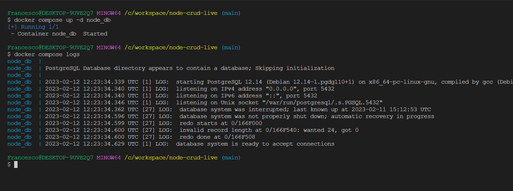
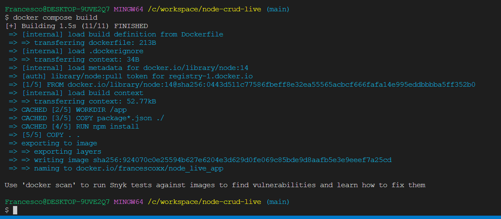
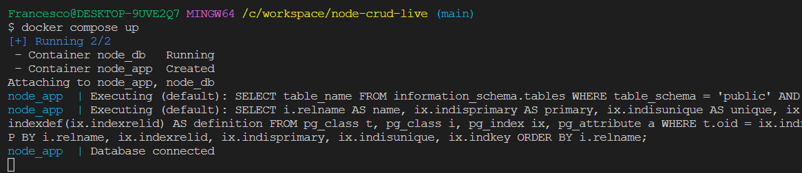

# Social Music App Server

This is the server-side application for the Social Music App.

## Table of Contents

- [Social Music App Server](#social-music-app-server)
  - [Table of Contents](#table-of-contents)
  - [How to Run the App Locally](#how-to-run-the-app-locally)
  - [How to Run the App Using Docker](#how-to-run-the-app-using-docker)
    - [Run PostgreSQL in a container](#run-postgresql-in-a-container)
    - [Build and Run the Docker Service](#build-and-run-the-docker-service)
    - [Test the App with Postman](#test-the-app-with-postman)

## How to Run the App Locally

1. **Clone the repository**

   ```bash
   git clone https://github.com/Yevgeniy-Dan/social-music-app-server.git
   cd social-music-app-server
   ```

2. **Install dependencies**
   ```bash
   npm install
   ```
3. **Set up the PostgreSQL database**
   - Make sure you have PostgreSQL installed and running locally.
   - Create a new PostgreSQL database.
4. **Configure environment variables**

   - Create a `.env` file in the project root directory.
   - Set the following environment variables in the `.env` file:

   ```bash
   NODE_ENV=development
   PORT=<your_app_port>
   CLIENT_ORIGIN=

   PG_HOST=localhost
   PG_USER=<your_database_user>
   PG_DB=<your_database_name>
   PG_PORT=5432
   PG_PASSWORD=<your_database_password>

   ```

   <!-- 5. **Run database migrations**
      ```bash
      npm run migrate
      ``` -->

5. **Start the server**

   ```bash
   npm run start:dev
   ```

   The server will start running on `http://localhost:${your_port}`.

6. Make a database migration using the `npm run migration:run` command

## How to Run the App Using Docker

To run the app using Docker, we need to set up a PostgreSQL database container and then run the app container.

### Run PostgreSQL in a container

**Copy the following commands to run the postgres container:**

```bash
docker compose up -d db
```

To check the logs, we can type:

```bash
docker compose logs
```

You should get an output similar to this one:



If we see "database system is ready to accept connections" we are good to go!

You can use DBeaver or other libraries to connect to postgres docker database with credentials pointed in `docker-compose.yml` file.

### Build and Run the Docker Service

1. **Build the Docker image:**

   ```bash
   docker compose build
   ```

   

2. **Start the service:**

   ```bash
   docker compose up music_social_app
   ```

   This should be the output on the terminal
   

3. **Populate the database with dummy data**

   - Access the running container

   ```bash
   docker exec -it music-social-app sh
   ```

   This command will open a shell session inside the running container.

   Make a database migration using the `npm run migration:run` command

   - Install DBeaver
   - Connect to a database running on a docker container
   - Make a data import (contact the owner for the files)

   <!-- - Run the seed script inside the container

   ```bash
   $ npm run seed
   ``` -->

<!-- This will execute the seed script using the Node.js environment inside the container. -->

### Test the App with Postman

Let's test the app using Postman.

1. Make a GET request to `http://localhost:8080`.

2. Make a GET request to `http://localhost:8080/posts`.

We should receive an empty array as a response.
